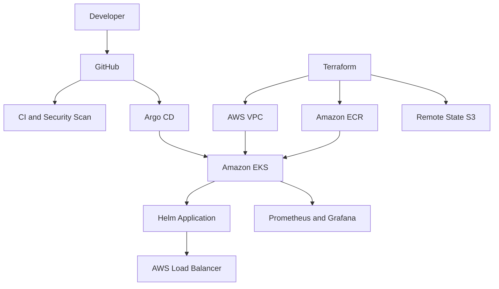

# AWS EKS Terraform GitOps Platform

[](https://github.com/hemantsharma2189/aws-eks-terraform-gitops-platform/actions/workflows/ci.yml)
[](https://github.com/hemantsharma2189/aws-eks-terraform-gitops-platform/actions/workflows/security.yml)
[](https://developer.hashicorp.com/terraform)
[](https://kubernetes.io/)
[](https://argo-cd.readthedocs.io/)

Production-style AWS EKS platform designed with Terraform, Kubernetes, Helm, Argo CD, GitHub Actions, Prometheus and Grafana.

## Project overview

This project demonstrates how a secure, scalable and automated Kubernetes platform can be designed on AWS.

The repository includes:

- Multi-AZ AWS VPC with public and private subnets
- Amazon EKS cluster with managed worker nodes
- Amazon ECR container registry
- Encrypted and versioned Terraform remote state
- S3 native state locking
- Helm-based Kubernetes application deployment
- Argo CD automated GitOps synchronization
- Horizontal Pod Autoscaling
- Prometheus and Grafana monitoring configuration
- Terraform and Helm CI validation
- Trivy infrastructure security scanning

## Architecture



Detailed architecture: [docs/architecture.md](docs/architecture.md)

## Repository structure

```text
.
├── bootstrap/               # Secure S3 remote-state bootstrap
├── terraform/               # VPC, EKS, ECR and AWS infrastructure
├── helm/application/        # Secure application Helm chart
├── gitops/argocd/           # Argo CD application definition
├── gitops/monitoring/       # Prometheus and Grafana values
├── docs/                    # Architecture documentation
└── .github/workflows/       # CI validation and security scanning
```

## Security controls

- Private EKS API endpoint
- Private worker-node subnets
- Encrypted EBS volumes
- Immutable ECR image tags
- ECR image scanning
- EKS control-plane audit logging
- S3 state encryption and versioning
- Public-access blocking for Terraform state
- HTTPS-only S3 bucket policy
- Non-root Kubernetes containers
- Disabled service-account token mounting
- Dropped Linux container capabilities
- Trivy IaC security scanning
- GitHub Actions least-privilege permissions

## CI/CD and GitOps

Every push and pull request automatically performs:

1. Terraform formatting checks
2. Terraform initialization without remote backend
3. Terraform configuration validation
4. Helm chart linting
5. Kubernetes manifest rendering
6. Trivy Terraform and Kubernetes security scanning

Argo CD is configured to monitor the Helm chart and automatically:

- Synchronize Git changes
- Repair configuration drift
- Remove resources deleted from Git
- Create the application namespace

## Local validation

Format the Terraform configuration:

```bash
terraform fmt -recursive
```

Validate the bootstrap configuration:

```bash
terraform -chdir=bootstrap init -backend=false
terraform -chdir=bootstrap validate
```

Validate the main infrastructure:

```bash
terraform -chdir=terraform init -backend=false
terraform -chdir=terraform validate
```

Validate the Helm chart:

```bash
helm lint helm/application
helm template cloud-platform-app helm/application
```

## Important cost notice

This repository is an infrastructure portfolio project and does not deploy AWS resources automatically.

Amazon EKS, NAT Gateway, Application Load Balancer and worker nodes can create significant AWS charges. Review AWS pricing, configure billing alerts and understand every resource before running `terraform apply`.

## Project status

- Infrastructure code: Complete
- Terraform validation: Passing
- Helm validation: Passing
- Security scanning: Passing
- AWS deployment: Not performed
- Purpose: Portfolio, learning and infrastructure design demonstration

## Author

**Hemant Sharma**

- GitHub: [hemantsharma2189](https://github.com/hemantsharma2189)
- LinkedIn: [hemantsharma20](https://www.linkedin.com/in/hemantsharma20/)
- Portfolio: [hemantsharma2189.github.io](https://hemantsharma2189.github.io/)

## License

This project is licensed under the MIT License.
