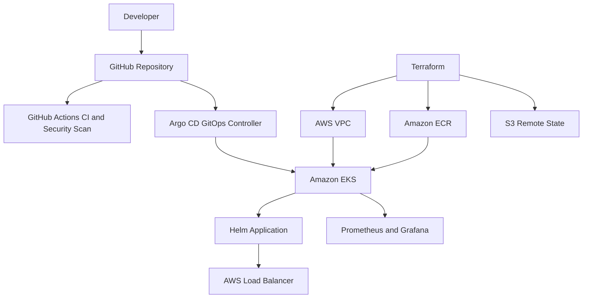

# AWS EKS GitOps Platform Architecture

## Platform flow

1. Terraform provisions the VPC, private subnets, EKS cluster, managed node group and ECR repository.
2. Terraform state is securely stored in a versioned and encrypted S3 bucket.
3. GitHub Actions validates Terraform and Helm code and performs infrastructure security scanning.
4. Argo CD monitors the GitHub repository and automatically synchronizes the Helm application.
5. Kubernetes HPA scales application pods based on CPU utilization.
6. Prometheus collects platform metrics and Grafana provides monitoring dashboards.

> This repository demonstrates production-style infrastructure code. AWS resources are not deployed by default to avoid unnecessary cloud charges.
